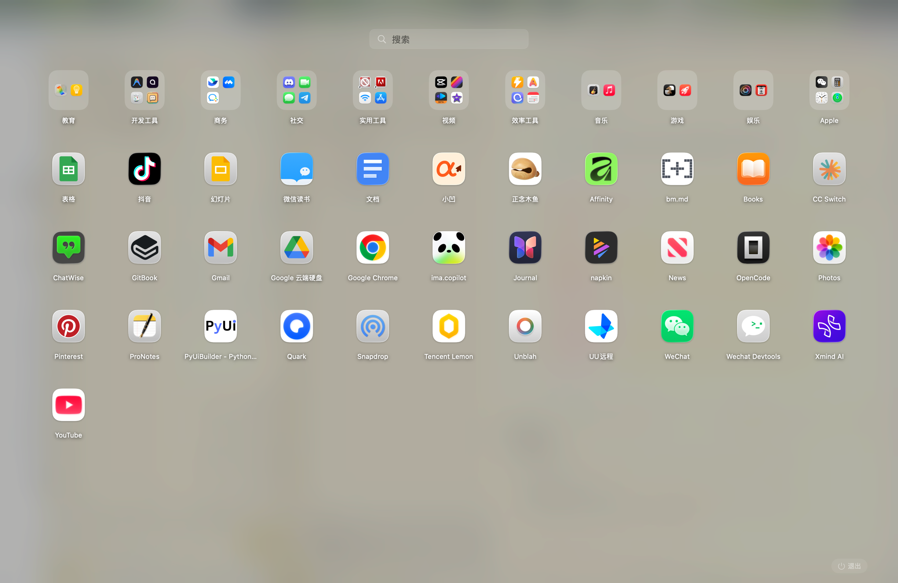

# QuickLaunch - macOS App Launcher

**English** | [中文](README_ZH.md)

> A signed and notarized native macOS app launcher. A faster, more practical Launchpad alternative with pinyin search, folders, instant launch feedback, and zero external dependencies.


[](https://github.com/vorojar/QuickLaunch/releases)



## Why QuickLaunch?

macOS Launchpad lacks pinyin search, category-based organization, context menus, and customizable hotkeys. QuickLaunch fills these gaps while keeping the same smooth, native feel. When you launch an app, QuickLaunch disappears immediately so slow target-app startup never feels like launcher lag.

## Latest Release

**v1.0.5** focuses on launch responsiveness and release quality:

- QuickLaunch now hides immediately when you click an app, before the target app starts opening.
- The distributed DMG is Developer ID signed, notarized, and stapled.
- SHA256: `028949fbfb2ff2a1ca1ac67b8ab73a5441515f410f3265ee4c9389bd9fe92324`

### vs. Native Launchpad

| Feature | Launchpad | QuickLaunch |
|---------|:-:|:-:|
| Full-screen blur | ✅ | ✅ |
| Drag & drop / folders | ✅ | ✅ |
| Search | ✅ | ✅ |
| Jiggle delete mode | ✅ | ✅ |
| Auto-detect installs | ✅ | ✅ |
| Pinyin search | ❌ | ✅ |
| Auto organize by category | ❌ | ✅ |
| Usage-based sorting | ❌ | ✅ |
| Context menu | ❌ | ✅ |
| Status bar access | ❌ | ✅ |
| Custom global hotkey | ❌ | ✅ |

## Features

- **Full-screen Launchpad** - Blurred wallpaper background, just like native macOS
- **App Grid** - Display all installed applications with smooth animations
- **Drag & Drop** - Reorder apps by dragging, create folders by dropping one app onto another
- **Folders** - Organize apps into folders, rename them, dissolve when needed
- **Search** - Real-time filtering with Chinese pinyin support
- **Instant Launch Feedback** - QuickLaunch hides immediately after you click an app
- **Auto Organize** - One-click automatic organization by app category
- **Global Hotkey** - Press `Cmd+Shift+Space` to launch from anywhere
- **Status Bar** - Quick access from menu bar
- **Auto Update** - Automatically detects newly installed/removed apps
- **Bilingual** - Chinese and English based on system language
- **Context Menu** - Right-click for Show in Finder, Get Info, Move to Trash

## Installation

### Method 1: Direct Download (Recommended)

1. Download the latest [QuickLaunch.dmg](https://github.com/vorojar/QuickLaunch/releases/latest)
2. Open the DMG and drag `QuickLaunch.app` to Applications folder
3. Double-click to launch

The release DMG is signed and notarized with Apple Developer ID.

### Method 2: Homebrew Cask Recipe

The repository includes a cask recipe at `Casks/quicklaunch.rb` for tap or submission workflows. The public Homebrew cask may not be available in every registry yet.

## Usage

| Action | How |
|--------|-----|
| Open Launchpad | `Cmd+Shift+Space` or click status bar icon |
| Close Launchpad | `Esc` or click outside |
| Launch App | Click on app icon |
| Search | Start typing |
| Quick Launch | Type and press `Enter` |
| Create Folder | Drag one app onto another |
| Rename Folder | Click folder to open, then click name |
| Reorder Apps | Drag and drop |
| Delete Mode | Long press on any app |
| Context Menu | Right-click on app |

## Performance

| Metric | Value |
|--------|-------|
| App Bundle | 1.4 MB |
| DMG Size | 476 KB |
| Memory | ~36 MB |
| Idle CPU | 0.0% |
| Dependencies | None |

Pure Swift, zero external dependencies. Icons are pre-rendered at launch for instant display with no frame drops.

## System Requirements

- macOS 14.0 (Sonoma) or later
- Apple Silicon or Intel Mac

## Build from Source

```bash
# Clone the repository
git clone https://github.com/vorojar/QuickLaunch.git
cd QuickLaunch

# Build and create app bundle + DMG
./scripts/build.sh

# Maintainer release packaging: build, remote-sign, notarize, staple, and validate
./scripts/release.sh

# Run
open QuickLaunch.app
```

## Data Storage

User data is stored in `~/Library/Application Support/QuickLaunch/`:

- `grid_layout.json` - App arrangement and folders
- `usage_stats.json` - App usage statistics
- `hidden_apps.json` - Apps removed from Launchpad

## License

MIT License

## Links

- [Website](https://vorojar.github.io/QuickLaunch)
- [Releases](https://github.com/vorojar/QuickLaunch/releases)

---

**Keywords:** macOS launcher, Launchpad alternative, Mac app launcher, macOS application launcher, Swift macOS app, pinyin search launcher, Launchpad replacement
